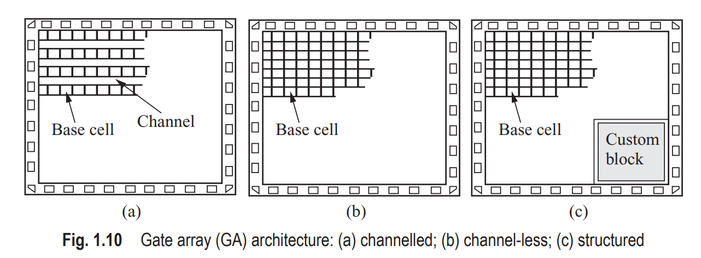
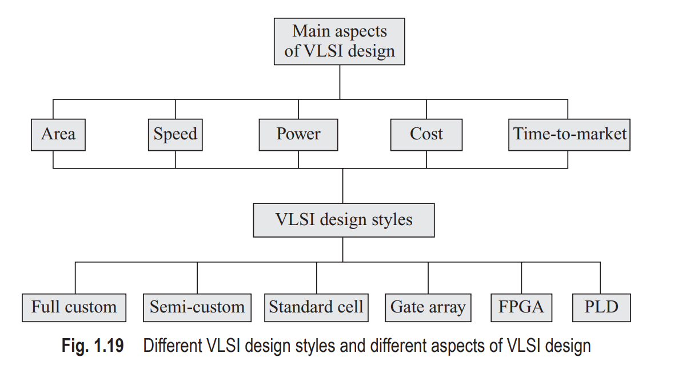

# Content of chapter 1

## 1. History Perspective

## 2. Introduction to IC Technology

## 3. Types of Intergrated Circuits 
 

## 4. Design Methodology

- VLSI design is asequential process of generating the physical layout of an IC, starting from the specification of that circuit. It can be fully or semi-automated using namerous softwares called electronic design automation (EDA) or computeraided design (CAD) tools.

- Formal language -> register transfer level (RTL) using HDL such as Verilog and VHDL.

## 5. Design Domains - Y-Chart

The IC design can be described in the following three domains:

-	 Behavioural
-	 Structural
-	 Physical

## 6. Hierarchical Abstraction

System: 
- Software
  - Application
  - OS
- Hardware
  - Module
  - Module

For example: 

Let us consider a CPU as a system at the top level 

CPU
- Datapath
    - ALU
        - Full adder
    - Registers
    - Shift registers
- Control

## 7. Design Flow

## 8. Design Styles 

The commonly used design styles are 
as follows:
-	 Field programmable gate array (FPGA) design
-	 Gate array design
-	 Standard cell-based design
-	 Full-custom design
-	 Semi-custom design
-	 Programmable logic device (PLD)

Gate Array Design

## 9. Design Metrics
- Functionality
- Cost 
- Reliability
- Performance
- Speed
- Time to market

## 10. Cost of Integrated Circuits
- The fixed cost.
 - Design cost 
 - Research and development cost 
 - Infrastructure building cost
 - Costs involved in marketing and sales
 - Cost of manufacturing equipment
 - Cost involved in training the manpower
 - COst of VLSI CAD tools.
- Variable cost.
 - Manufactured cost.
 - Cost of assembly.
 - Testing cost.

 **Total product cost = Fixed cost + Variable cost x Number of product sold**

 **Cost per IC = Variable cost per IC + Fixed cost/Number of ICs**

 

##  11. Problems in VLSI CAD Domain

 Most of the problems in VLSI design are optimization problems.Commonly used algorithmic approaches in VLSI CAD are as follows:

 - Greedy algorithm. ( channel routing )
 - Stochastic algorithm.
 - Graph methods. ( routing problem )
 - Mathematical programming.
 - Dynamic programming.
 - Computational geometry.

## 12. What is Important in Solving CAD VLSI Problems ?

- Challenges in design of VLSI chips and system on chips (SoCs) are multifacted. Therefore, it is required to develop solutions to the multiobjective optimization problems.

- Design automation is indispensable.

- Quest for new materials and fabrication technologies.

- VLSI design and efficent CAD tools for multimedia applications.

- Desiderata for newcomers to the area of VLSI-CAD.

## 13. Three dimensional Chips

In the 3D integration, extra active layers (such as T1, T2, T3) added in between 
the metal layers can implement logic at one level, memory at another level, and 
I/O at another level. This reduces the interconnect length between active layers 
and hence the delay. Another approach is to bond fully processed wafers on which 
the circuits are fabricated. Only the interconnections between the dies have to 
be made and packaged. This type of integration is not fully 3D, but 2.5D, and is 
called systems on a package

- Nanoelectronic devices 
  - Solid-state devices
      - Resonant tunnelling diodes (RTDs)
      - Single electron technology (SET)
      - Spin transistors
      - Ballistic electron devices
  - Molecular devices
      - Organic tránistors
      - Carbon nanotubes (CNTs)
      - Monomolecular transistors

## Summary

1. A VLSI design contains millions of components integrated over a small area of silicon.

2. MOSFETS are mostly used for fabricating ICs worldwide. Its structure is very well 
suited to IC fabrication technology which is also referred to as planar technology.

3.  Silicon is the mostly used material for manufacturing ICs. 

4. 	 FPGA-based VLSI design is suitable for prototype development as the design 
cycle time is very short.

5. Full-custom design is used for high performance and high volume products. The 
chips are highly optimized in design but require long design cycle time.

6. Computer-aided design (CAD) tools are must for state-of-the-art VLSI design

7. With advancement of technology, the dimensions are shrunk to almost 0.7× per 
generation and the integration density continues to increase.

8. VLSI design is a multidisciplinary domain where all branches of science and 
technology play key roles

9. The ideas of system-on-chip (SOC) and three-dimensional (3D) IC are the 
future VLSI projections
