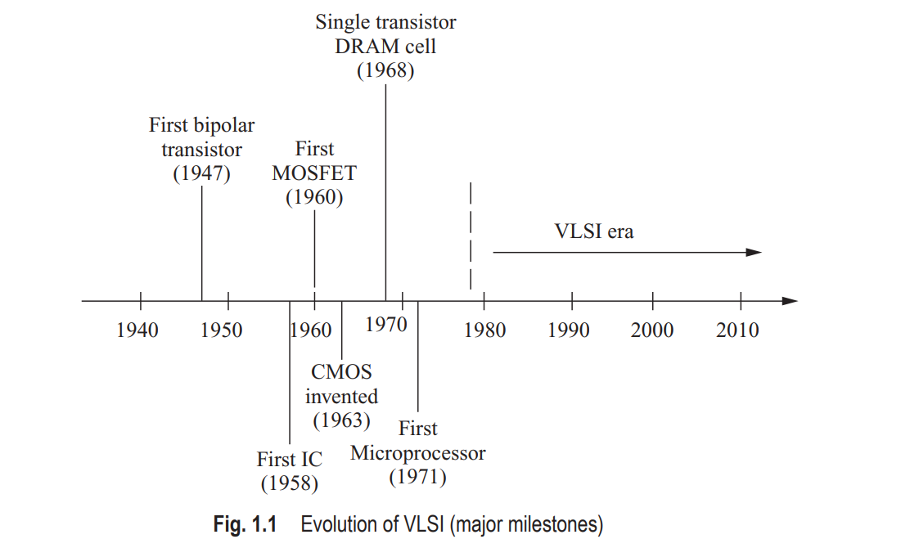
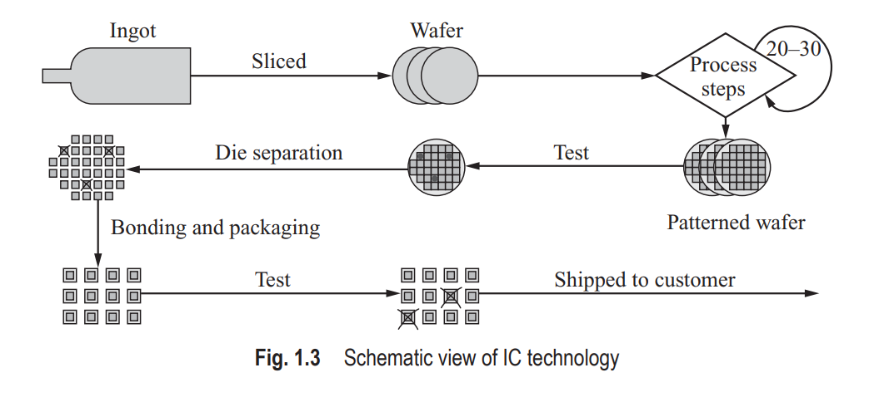
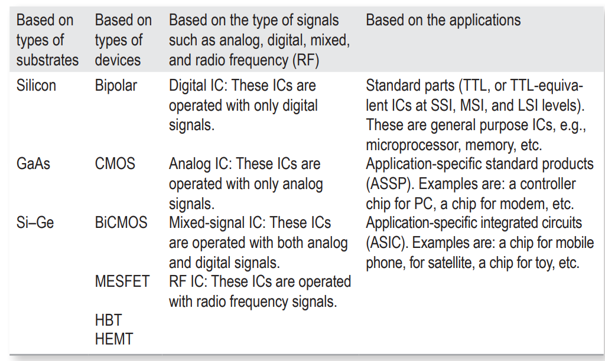
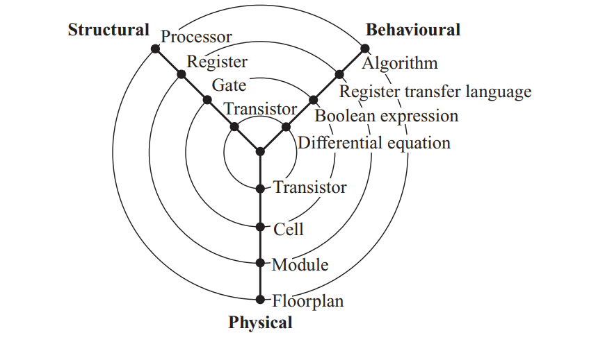
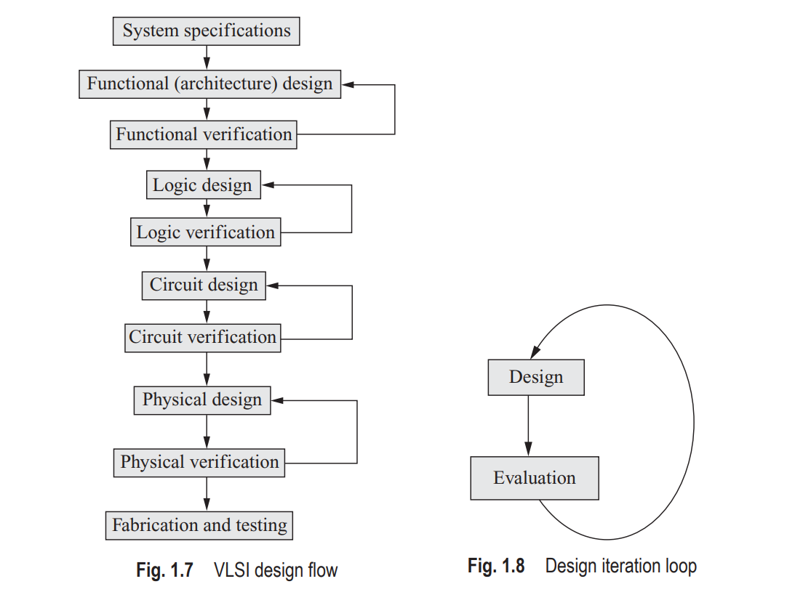

# Content of chapter 1

1. History Perspective

2. Introduction to IC Technology

3. Types of Intergrated Circuits 

4. Design Methodology

- VLSI design is asequential process of generating the physical layout of an IC, starting from the specification of that circuit. It can be fully or semi-automated using namerous softwares called electronic design automation (EDA) or computeraided design (CAD) tools.

- Formal language -> register transfer level (RTL) using HDL such as Verilog and VHDL.

5. Design Domains - Y-Chart

The IC design can be described in the following three domains:

-	 Behavioural
-	 Structural
-	 Physical

6. Hierarchical Abstraction

System: 
- Software
  - Application
  - OS
- Hardware
  - Module
  - Module

For example: 

Let us consider a CPU as a system at the top level 

CPU
- Datapath
    - ALU
        - Full adder
    - Registers
    - Shift registers
- Control

7. Design Flow

8. Design Styles 

The commonly used design styles are 
as follows:
-	 Field programmable gate array (FPGA) design
-	 Gate array design
-	 Standard cell-based design
-	 Full-custom design
-	 Semi-custom design
-	 Programmable logic device (PLD)
